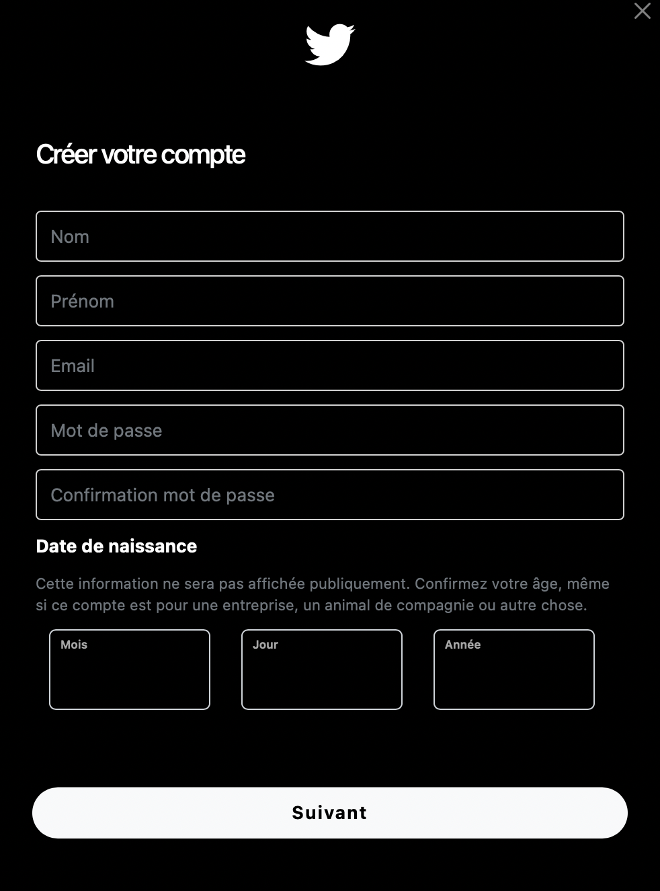
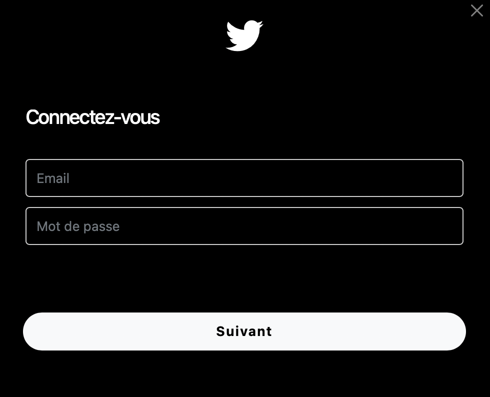
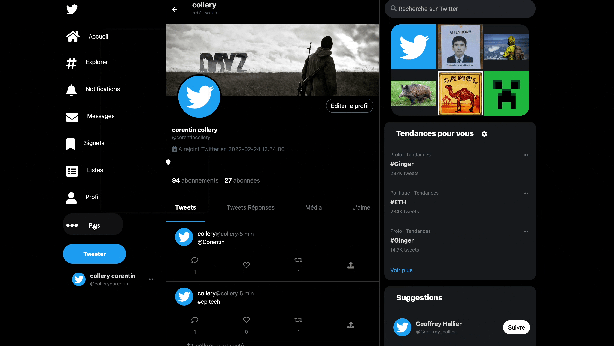

<h1 align="center"> Tweet-Academy</h1>

 

### Table of contents

1. [Projet](#Projet)
2. [Fonctionnalités](#Fonctionnalités)
3. [Contact](#Contact)

***

***

## Projet

 
 Le but de ce projet est de créer un réseau social qui aura les mêmes fonctionnalités que twitter. Il devra être le plus ressemblant possible en terme de fonctionnalités par rapport au site “Twitter”.

 

## Fonctionnalités
<h3>Création d'un compte</h3>

***

<h3>Connexion au compte</h3>

***

<h3>Création de tweet, retweet et commentaire</h3>

***

<h3>#Hashtag et @Arobase</h3>

***

<h3>Choisir son thème</h3>

***

<h3>Modifier son profil</h3>
    
***

## Resultat :

 
 

## Contact

<ul>
    <li><a href="https://github.com/ColleryCorentin">GitHub</a></li>
    <li><a href="https://www.linkedin.com/in/collerycorentin">Linkedin</a></li>
</ul>